# Core Semantic AST

## 1. Text Tree

```text
└── PROGRAM
    ├── FUNCTION_DEF("add")
    │   ├── PARAMETER("x")
    │   ├── PARAMETER("y")
    │   └── BLOCK
    │       └── RETURN_STMT
    │           └── BINARY_EXPR("+")
    │               ├── IDENTIFIER("x")
    │               └── IDENTIFIER("y")
    └── MAIN_FUNCTION("main")
        └── BLOCK
            ├── DECLARATION
            │   └── IDENTIFIER("a")
            ├── DECLARATION
            │   ├── IDENTIFIER("b")
            │   └── INT_LITERAL("5")
            ├── ASSIGNMENT
            │   ├── IDENTIFIER("a")
            │   └── FUNCTION_CALL("add")
            │       ├── IDENTIFIER("b")
            │       └── INT_LITERAL("3")
            ├── IF_STMT
            │   ├── BINARY_EXPR("<")
            │   │   ├── IDENTIFIER("a")
            │   │   └── IDENTIFIER("b")
            │   ├── ASSIGNMENT
            │   │   ├── IDENTIFIER("a")
            │   │   └── FUNCTION_CALL("add")
            │   │       ├── IDENTIFIER("a")
            │   │       └── INT_LITERAL("1")
            │   └── ASSIGNMENT
            │       ├── IDENTIFIER("a")
            │       └── FUNCTION_CALL("add")
            │           ├── IDENTIFIER("a")
            │           └── IDENTIFIER("b")
            ├── EXPRESSION_STMT
            │   └── FUNCTION_CALL("add")
            │       ├── IDENTIFIER("a")
            │       └── IDENTIFIER("b")
            ├── WHILE_STMT
            │   ├── BINARY_EXPR("!=")
            │   │   ├── IDENTIFIER("a")
            │   │   └── IDENTIFIER("b")
            │   └── BLOCK
            │       └── ASSIGNMENT
            │           ├── IDENTIFIER("a")
            │           └── FUNCTION_CALL("add")
            │               ├── IDENTIFIER("a")
            │               └── INT_LITERAL("1")
            └── RETURN_STMT
                └── IDENTIFIER("a")
```

## 2. Mermaid Tree

```mermaid
graph TD
    n0["PROGRAM"]
    n1["FUNCTION_DEF\\ntext: add"]
    n2["PARAMETER\\ntext: x"]
    n1 --> n2
    n3["PARAMETER\\ntext: y"]
    n1 --> n3
    n4["BLOCK"]
    n5["RETURN_STMT"]
    n6["BINARY_EXPR\\ntext: +"]
    n7["IDENTIFIER\\ntext: x"]
    n6 --> n7
    n8["IDENTIFIER\\ntext: y"]
    n6 --> n8
    n5 --> n6
    n4 --> n5
    n1 --> n4
    n0 --> n1
    n9["MAIN_FUNCTION\\ntext: main"]
    n10["BLOCK"]
    n11["DECLARATION"]
    n12["IDENTIFIER\\ntext: a"]
    n11 --> n12
    n10 --> n11
    n13["DECLARATION"]
    n14["IDENTIFIER\\ntext: b"]
    n13 --> n14
    n15["INT_LITERAL\\ntext: 5"]
    n13 --> n15
    n10 --> n13
    n16["ASSIGNMENT"]
    n17["IDENTIFIER\\ntext: a"]
    n16 --> n17
    n18["FUNCTION_CALL\\ntext: add"]
    n19["IDENTIFIER\\ntext: b"]
    n18 --> n19
    n20["INT_LITERAL\\ntext: 3"]
    n18 --> n20
    n16 --> n18
    n10 --> n16
    n21["IF_STMT"]
    n22["BINARY_EXPR\\ntext: <"]
    n23["IDENTIFIER\\ntext: a"]
    n22 --> n23
    n24["IDENTIFIER\\ntext: b"]
    n22 --> n24
    n21 --> n22
    n25["ASSIGNMENT"]
    n26["IDENTIFIER\\ntext: a"]
    n25 --> n26
    n27["FUNCTION_CALL\\ntext: add"]
    n28["IDENTIFIER\\ntext: a"]
    n27 --> n28
    n29["INT_LITERAL\\ntext: 1"]
    n27 --> n29
    n25 --> n27
    n21 --> n25
    n30["ASSIGNMENT"]
    n31["IDENTIFIER\\ntext: a"]
    n30 --> n31
    n32["FUNCTION_CALL\\ntext: add"]
    n33["IDENTIFIER\\ntext: a"]
    n32 --> n33
    n34["IDENTIFIER\\ntext: b"]
    n32 --> n34
    n30 --> n32
    n21 --> n30
    n10 --> n21
    n35["EXPRESSION_STMT"]
    n36["FUNCTION_CALL\\ntext: add"]
    n37["IDENTIFIER\\ntext: a"]
    n36 --> n37
    n38["IDENTIFIER\\ntext: b"]
    n36 --> n38
    n35 --> n36
    n10 --> n35
    n39["WHILE_STMT"]
    n40["BINARY_EXPR\\ntext: !="]
    n41["IDENTIFIER\\ntext: a"]
    n40 --> n41
    n42["IDENTIFIER\\ntext: b"]
    n40 --> n42
    n39 --> n40
    n43["BLOCK"]
    n44["ASSIGNMENT"]
    n45["IDENTIFIER\\ntext: a"]
    n44 --> n45
    n46["FUNCTION_CALL\\ntext: add"]
    n47["IDENTIFIER\\ntext: a"]
    n46 --> n47
    n48["INT_LITERAL\\ntext: 1"]
    n46 --> n48
    n44 --> n46
    n43 --> n44
    n39 --> n43
    n10 --> n39
    n49["RETURN_STMT"]
    n50["IDENTIFIER\\ntext: a"]
    n49 --> n50
    n10 --> n49
    n9 --> n10
    n0 --> n9
```


