# Core Semantic AST

## 1. 核心语义 AST 数据结构

| 节点ID | 节点类型 | 文本值 | 孩子节点 |
|---|---|---|---|
| n0 | PROGRAM | - | n1, n9 |
| n1 | FUNCTION_DEF | add | n2, n3, n4 |
| n2 | PARAMETER | x | - |
| n3 | PARAMETER | y | - |
| n4 | BLOCK | - | n5 |
| n5 | RETURN_STMT | - | n6 |
| n6 | BINARY_EXPR | + | n7, n8 |
| n7 | IDENTIFIER | x | - |
| n8 | IDENTIFIER | y | - |
| n9 | MAIN_FUNCTION | main | n10 |
| n10 | BLOCK | - | n11, n13, n16, n21, n35, n39, n49 |
| n11 | DECLARATION | - | n12 |
| n12 | IDENTIFIER | a | - |
| n13 | DECLARATION | - | n14, n15 |
| n14 | IDENTIFIER | b | - |
| n15 | INT_LITERAL | 5 | - |
| n16 | ASSIGNMENT | - | n17, n18 |
| n17 | IDENTIFIER | a | - |
| n18 | FUNCTION_CALL | add | n19, n20 |
| n19 | IDENTIFIER | b | - |
| n20 | INT_LITERAL | 3 | - |
| n21 | IF_STMT | - | n22, n25, n30 |
| n22 | BINARY_EXPR | < | n23, n24 |
| n23 | IDENTIFIER | a | - |
| n24 | IDENTIFIER | b | - |
| n25 | ASSIGNMENT | - | n26, n27 |
| n26 | IDENTIFIER | a | - |
| n27 | FUNCTION_CALL | add | n28, n29 |
| n28 | IDENTIFIER | a | - |
| n29 | INT_LITERAL | 1 | - |
| n30 | ASSIGNMENT | - | n31, n32 |
| n31 | IDENTIFIER | a | - |
| n32 | FUNCTION_CALL | add | n33, n34 |
| n33 | IDENTIFIER | a | - |
| n34 | IDENTIFIER | b | - |
| n35 | EXPRESSION_STMT | - | n36 |
| n36 | FUNCTION_CALL | add | n37, n38 |
| n37 | IDENTIFIER | a | - |
| n38 | IDENTIFIER | b | - |
| n39 | WHILE_STMT | - | n40, n43 |
| n40 | BINARY_EXPR | != | n41, n42 |
| n41 | IDENTIFIER | a | - |
| n42 | IDENTIFIER | b | - |
| n43 | BLOCK | - | n44 |
| n44 | ASSIGNMENT | - | n45, n46 |
| n45 | IDENTIFIER | a | - |
| n46 | FUNCTION_CALL | add | n47, n48 |
| n47 | IDENTIFIER | a | - |
| n48 | INT_LITERAL | 1 | - |
| n49 | RETURN_STMT | - | n50 |
| n50 | IDENTIFIER | a | - |

## 2. 文本形式核心语义 AST

```text
└── PROGRAM
    ├── FUNCTION_DEF("add")
    │   ├── PARAMETER("x")
    │   ├── PARAMETER("y")
    │   └── BLOCK
    │       └── RETURN_STMT
    │           └── BINARY_EXPR("+")
    │               ├── IDENTIFIER("x")
    │               └── IDENTIFIER("y")
    └── MAIN_FUNCTION("main")
        └── BLOCK
            ├── DECLARATION
            │   └── IDENTIFIER("a")
            ├── DECLARATION
            │   ├── IDENTIFIER("b")
            │   └── INT_LITERAL("5")
            ├── ASSIGNMENT
            │   ├── IDENTIFIER("a")
            │   └── FUNCTION_CALL("add")
            │       ├── IDENTIFIER("b")
            │       └── INT_LITERAL("3")
            ├── IF_STMT
            │   ├── BINARY_EXPR("<")
            │   │   ├── IDENTIFIER("a")
            │   │   └── IDENTIFIER("b")
            │   ├── ASSIGNMENT
            │   │   ├── IDENTIFIER("a")
            │   │   └── FUNCTION_CALL("add")
            │   │       ├── IDENTIFIER("a")
            │   │       └── INT_LITERAL("1")
            │   └── ASSIGNMENT
            │       ├── IDENTIFIER("a")
            │       └── FUNCTION_CALL("add")
            │           ├── IDENTIFIER("a")
            │           └── IDENTIFIER("b")
            ├── EXPRESSION_STMT
            │   └── FUNCTION_CALL("add")
            │       ├── IDENTIFIER("a")
            │       └── IDENTIFIER("b")
            ├── WHILE_STMT
            │   ├── BINARY_EXPR("!=")
            │   │   ├── IDENTIFIER("a")
            │   │   └── IDENTIFIER("b")
            │   └── BLOCK
            │       └── ASSIGNMENT
            │           ├── IDENTIFIER("a")
            │           └── FUNCTION_CALL("add")
            │               ├── IDENTIFIER("a")
            │               └── INT_LITERAL("1")
            └── RETURN_STMT
                └── IDENTIFIER("a")
```

## 3. Mermaid 可视化核心语义 AST

```mermaid
flowchart TD
    n0["n0: PROGRAM"]
    n1["n1: FUNCTION_DEF<br/>text = add"]
    n2["n2: PARAMETER<br/>text = x"]
    n3["n3: PARAMETER<br/>text = y"]
    n4["n4: BLOCK"]
    n5["n5: RETURN_STMT"]
    n6["n6: BINARY_EXPR<br/>text = +"]
    n7["n7: IDENTIFIER<br/>text = x"]
    n8["n8: IDENTIFIER<br/>text = y"]
    n9["n9: MAIN_FUNCTION<br/>text = main"]
    n10["n10: BLOCK"]
    n11["n11: DECLARATION"]
    n12["n12: IDENTIFIER<br/>text = a"]
    n13["n13: DECLARATION"]
    n14["n14: IDENTIFIER<br/>text = b"]
    n15["n15: INT_LITERAL<br/>text = 5"]
    n16["n16: ASSIGNMENT"]
    n17["n17: IDENTIFIER<br/>text = a"]
    n18["n18: FUNCTION_CALL<br/>text = add"]
    n19["n19: IDENTIFIER<br/>text = b"]
    n20["n20: INT_LITERAL<br/>text = 3"]
    n21["n21: IF_STMT"]
    n22["n22: BINARY_EXPR<br/>text = &lt;"]
    n23["n23: IDENTIFIER<br/>text = a"]
    n24["n24: IDENTIFIER<br/>text = b"]
    n25["n25: ASSIGNMENT"]
    n26["n26: IDENTIFIER<br/>text = a"]
    n27["n27: FUNCTION_CALL<br/>text = add"]
    n28["n28: IDENTIFIER<br/>text = a"]
    n29["n29: INT_LITERAL<br/>text = 1"]
    n30["n30: ASSIGNMENT"]
    n31["n31: IDENTIFIER<br/>text = a"]
    n32["n32: FUNCTION_CALL<br/>text = add"]
    n33["n33: IDENTIFIER<br/>text = a"]
    n34["n34: IDENTIFIER<br/>text = b"]
    n35["n35: EXPRESSION_STMT"]
    n36["n36: FUNCTION_CALL<br/>text = add"]
    n37["n37: IDENTIFIER<br/>text = a"]
    n38["n38: IDENTIFIER<br/>text = b"]
    n39["n39: WHILE_STMT"]
    n40["n40: BINARY_EXPR<br/>text = !="]
    n41["n41: IDENTIFIER<br/>text = a"]
    n42["n42: IDENTIFIER<br/>text = b"]
    n43["n43: BLOCK"]
    n44["n44: ASSIGNMENT"]
    n45["n45: IDENTIFIER<br/>text = a"]
    n46["n46: FUNCTION_CALL<br/>text = add"]
    n47["n47: IDENTIFIER<br/>text = a"]
    n48["n48: INT_LITERAL<br/>text = 1"]
    n49["n49: RETURN_STMT"]
    n50["n50: IDENTIFIER<br/>text = a"]
    n0 --> n1
    n0 --> n9
    n1 --> n2
    n1 --> n3
    n1 --> n4
    n4 --> n5
    n5 --> n6
    n6 --> n7
    n6 --> n8
    n9 --> n10
    n10 --> n11
    n10 --> n13
    n10 --> n16
    n10 --> n21
    n10 --> n35
    n10 --> n39
    n10 --> n49
    n11 --> n12
    n13 --> n14
    n13 --> n15
    n16 --> n17
    n16 --> n18
    n18 --> n19
    n18 --> n20
    n21 --> n22
    n21 --> n25
    n21 --> n30
    n22 --> n23
    n22 --> n24
    n25 --> n26
    n25 --> n27
    n27 --> n28
    n27 --> n29
    n30 --> n31
    n30 --> n32
    n32 --> n33
    n32 --> n34
    n35 --> n36
    n36 --> n37
    n36 --> n38
    n39 --> n40
    n39 --> n43
    n40 --> n41
    n40 --> n42
    n43 --> n44
    n44 --> n45
    n44 --> n46
    n46 --> n47
    n46 --> n48
    n49 --> n50
```


