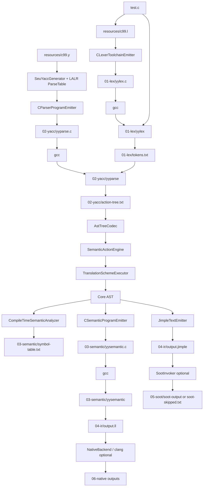

# 1. 最终项目定位

这是一个基于 LEX/YACC 思路的编译流程项目。

- 词法阶段使用 `resources/c99.l` 生成 C 词法程序。
- 语法阶段使用 `resources/c99.y` 构造 LALR parse table，并生成 C 语法程序。
- 语义和 IR 阶段只支持 MiniC/C 子集。
- 后端真实支持 LLVM IR 文本输出。
- `clang` 属于可选 native backend。
- `Soot` 属于可选后端接入，当前默认流程只生成 Jimple 文本并记录 skipped。

# 2. 当前真实主流程

当前真实主入口是：

- 命令行入口：`com.example.compiler.CompilerPipeline`
- 核心执行入口：`com.example.compiler.Compiler.compileStrictFlowchart(...)`
- 默认测试：`FlowchartPipelineEndToEndTest` 和 `NativeBackendEndToEndTest`

当前真实流程是：

```text
test.c
-> resources/c99.l
-> CLexerToolchainEmitter
-> generated/.../01-lex/yylex.c
-> gcc
-> generated/.../01-lex/yylex
-> generated/.../01-lex/tokens.txt

resources/c99.y
-> SeuYaccGenerator / YaccParser / LR(1) / LALR / ParseTable
-> CParserProgramEmitter
-> generated/.../02-yacc/yyparse.c
-> gcc
-> generated/.../02-yacc/yyparse
-> generated/.../02-yacc/action-tree.txt

action-tree.txt
-> AstTreeCodec
-> SemanticActionEngine
-> TranslationSchemeExecutor
-> Core AST
-> CompileTimeSemanticAnalyzer
-> SymbolTable

Core AST
-> CSemanticProgramEmitter
-> generated/.../03-semantic/yysemantic.c
-> gcc
-> generated/.../03-semantic/yysemantic
-> generated/.../04-ir/output.ll

Core AST / preliminary IR
-> JimpleTextEmitter
-> generated/.../04-ir/output.jimple

output.ll
-> NativeBackend / clang, optional
-> validate.o / output.s / output.o / native-executable

output.jimple
-> SootInvoker, optional
-> soot-output or soot-skipped.txt
```

当前实现和老师图片基本一致的部分：`yylex.c`、`yyparse.c`、`action-tree.txt`、`AstTreeCodec`、`SemanticActionEngine`、`TranslationSchemeExecutor`、Core AST、`yysemantic.c`、LLVM IR 都是真实落盘或真实执行。

当前实现和老师图片存在差异的部分：Jimple 到 Soot/class 默认没有真实运行；只有设置 `SOOT_JAR` 且请求 bytecode 输出时才会调用 Soot。语义和 IR 只覆盖 MiniC 子集，不覆盖完整 C99。

# 3. 实际控制流图



# 4. 实际模块关系

| 模块 | 输入 | 输出 | 是否真实实现 |
|---|---|---|---|
| `CompilerPipeline` | CLI 参数 | 调用主流程，打印产物路径 | 已实现 |
| `Compiler.compileStrictFlowchart` | `c99.l`、`c99.y`、`test.c`、输出目录 | 分阶段产物、trace、evidence | 已实现 |
| `SeuLexParser` | `c99.l` | 词法规则模型 | 已实现 |
| `CLexerToolchainEmitter` | `c99.l` | `yylex.c` | 已实现 |
| `gcc` | `yylex.c` | `yylex` | 已真实调用 |
| `yylex` | `test.c` | `tokens.txt` | 已真实运行 |
| `YaccParser` | `c99.y` | Grammar | 已实现 |
| `SeuYaccGenerator` | Grammar | LR(1)/LALR parse table | 已实现 |
| `CParserProgramEmitter` | Grammar、ParseTable、语义动作映射 | `yyparse.c` | 已实现 |
| `gcc` | `yyparse.c` | `yyparse` | 已真实调用 |
| `yyparse` | `tokens.txt` | `action-tree.txt` | 已真实运行 |
| `AstTreeCodec` | `action-tree.txt` | `AstNode` action tree | 已实现 |
| `TranslationSchemeExecutor` | action tree | 节点 semantic value | 已实现 |
| `SemanticActionEngine` | action tree | `SemanticResult` | 已实现 |
| `CoreAstNode`/`AstKind` | 语义动作结果 | Core AST | 已实现 |
| `CompileTimeSemanticAnalyzer` | Core AST | `SymbolTable` | 已实现 |
| `CSemanticProgramEmitter` | Core AST | `yysemantic.c` | 已实现 |
| `gcc` | `yysemantic.c` | `yysemantic` | 已真实调用 |
| `yysemantic` | 无运行时输入 | LLVM IR stdout | 已真实运行 |
| `JimpleTextEmitter` | `SemanticResult` | `output.jimple` | 已实现文本输出 |
| `SootInvoker` | `output.jimple`、`SOOT_JAR` | Soot 输出或 skipped | 部分实现，默认跳过 |
| `NativeBackend` | `output.ll`、`clang` | native backend outputs | 已实现，可选 |

# 5. 当前和老师要求的差异

老师要求的已真实实现部分：

- `c99.l -> LEX -> yylex.c -> gcc -> yylex -> tokens.txt`
- `c99.y -> YACC -> yyparse.c -> gcc -> yyparse -> action-tree.txt`
- `action-tree.txt -> AstTreeCodec -> SemanticActionEngine -> TranslationSchemeExecutor -> Core AST`
- `Core AST -> CompileTimeSemanticAnalyzer -> SymbolTable`
- `Core AST -> CSemanticProgramEmitter -> yysemantic.c -> gcc -> yysemantic`
- `yysemantic -> LLVM IR .ll`
- `Core AST -> JimpleTextEmitter -> Jimple .jimple`
- `LLVM IR -> clang -> native executable`，作为可选 backend 已实现并由默认 native 测试验证。

老师要求中当前仍有差异的部分：

- 语义和 IR 不是完整 C99，只是 MiniC/C 子集。
- Jimple 到 Soot/class 不是默认完成项；没有 `SOOT_JAR` 或没有请求 bytecode 输出时只写 `soot-skipped.txt`。
- 当前严格主流程虽然代码中存在 `FUNCTION_CALL`、`ASSIGNMENT` 等 Core AST 支撑，但 `C99SubsetSemanticActions` 没有完整覆盖 `c99.y` 中所有对应产生式，所以不能宣称函数调用、参数和赋值语句已在主流程完整支持。
- 默认样例和默认测试验证的是 `int main() { int a = 1; int b = 2; return a + b; }` 这一类基础子集。

# 6. 如果要完全符合老师流程，还缺什么

- 扩展 `C99SubsetSemanticActions`，把 `assignment_expression -> unary_expression assignment_operator assignment_expression` 映射到 `makeAssignment`。
- 扩展 `C99SubsetSemanticActions`，把函数参数、函数调用和 argument list 映射到 `makeParam`、`makeCall` 等动作。
- 为 if/while 条件补齐 i32 到 i1 的 LLVM 条件转换，避免非比较表达式作为 `br i1` 时 IR 不合法。
- 明确 Jimple 输出格式是否必须被 Soot 接受；如果必须，需要让 `JimpleTextEmitter` 生成 Soot 可消费的完整 Jimple 工程结构。
- 为 `SootInvoker` 增加默认可验证 fixture，或在答辩中明确 Soot 是可选接入。
- 增加覆盖 assignment、function call、parameters、if、while 的严格 flowchart 端到端测试。
