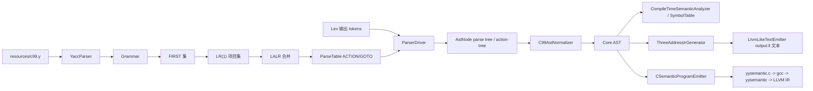

# Yacc 与中间代码生成项目理解手册

## 1. 我负责的模块范围

本项目中，我负责的核心范围可以分成两段：Yacc 语法分析程序生成部分，以及语义分析/中间代码生成部分。Lex 部分不是本手册重点，只需要知道它把 C 源码转换成 token 序列；Yacc 部分不直接分析原始 `test.c` 字符流，而是读取 token。

当前仓库实际主入口是 `com.example.compiler.Compiler`，不是 `CompilerPipeline`。源码中也没有独立的 `AstTreeCodec`、`JimpleTextEmitter`、`NativeBackend` 类。已有实现更像“Java 内部表驱动主流程 + yysemantic.c 生成路线”：`resources/c99.y -> SeuYaccGenerator -> ParserDriver -> AstNode -> C99AstNormalizer/CoreAstNode -> SymbolTable -> IR -> CSemanticProgramEmitter/yysemantic.c`。

Yacc 使用完整 `resources/c99.y` 的意义是：语法分析阶段可以用完整 C99 文法构造分析表，并接受较完整的语法结构。中间代码生成只支持项目定义的 C 子集，这是合理边界，因为完整 C99 的指针、数组、结构体、typedef、复杂声明、类型转换和库调用都需要更大的类型系统与运行时支持。

## 2. 总体流程

文字版流程如下：

```text
c99.l -> GeneratedLexer/Token -> tokens
c99.y -> YaccParser -> Grammar -> FIRST -> LR(1) -> LALR -> ParseTable
tokens + ParseTable -> ParserDriver -> AstNode parse tree / action-tree
AstNode -> C99AstNormalizer -> CoreAstNode
CoreAstNode -> CompileTimeSemanticAnalyzer -> SymbolTable
CoreAstNode -> ThreeAddressIrGenerator -> IrInstruction
IrInstruction -> LlvmLikeTextEmitter -> LLVM-like IR
ParseTable -> CParserProgramEmitter -> yyparse.c -> gcc -> yyparse -> action-tree.txt
CoreAstNode -> CSemanticProgramEmitter -> yysemantic.c -> gcc -> yysemantic -> LLVM IR
```

Mermaid 图：



## 3. Yacc 部分详细设计

### 3.1 c99.y 的作用

`resources/c99.y` 是语法规则文件，不是待编译的 C 源码。它描述 C 语言 token 如何组合成声明、表达式、语句、函数定义和 translation unit。`YaccParser` 读取的是 `c99.y`，而 `ParserDriver` 读取的是 Lex 产生的 token 列表。

### 3.2 Grammar 数据结构

`Grammar` 保存终结符、非终结符、产生式、开始符号、增广开始符号、EOF 和优先级信息。`Production` 表示 `A -> α`，它有稳定的 id，规约动作会引用这个 id，`AstNode` 也会保留 productionId，便于调试规约过程。

终结符主要来自 `%token` 和字符字面量，如 `';'` 会被转换成 `SEMI`。非终结符来自规则左部和未声明为 token 的右部符号。增广产生式通常是 `translation_unit' -> translation_unit`，用于构造 accept 动作。

### 3.3 FIRST 集

`FirstSetCalculator` 计算每个符号的 FIRST 集和非终结符 nullable 属性。算法是典型不动点迭代：终结符 FIRST 初始化为自身，非终结符从空集开始，然后反复扫描产生式，把右部符号的 FIRST 传播给左部，直到没有变化。

FIRST 集在 LR(1) closure 中非常关键。若项目是 `A -> α · B β, a`，新增 `B -> · γ, b` 时，`b` 来自 `FIRST(βa)`。如果没有 FIRST 集，就无法准确计算 LR(1) 项目的 lookahead。

### 3.4 LR(1) 项目集

`LR1Item` 表示 `A -> α · β, lookahead`。其中 production 是产生式，dotPosition 是点位置，lookahead 是规约展望符。

`ClosureBuilder.closure()` 做 closure：看到点后是非终结符 B，就把 B 的所有产生式加入项目集，并按 `FIRST(βa)` 分配 lookahead。

`ClosureBuilder.goTo()` 做 goto：把点后为某个符号 X 的项目统一前移一位，再求 closure，得到自动机转移目标状态。

`CanonicalCollectionBuilder.build()` 从增广开始项目 `S' -> · S, EOF` 出发，用 BFS 生成所有 LR(1) 状态和状态转移。

### 3.5 LALR 合并

`LALRConverter` 把 LR(1) 状态按 LR(0) core 合并。core 只看“产生式 id + 点位置”，不看 lookahead。拥有相同 core 的状态合并后，lookahead 等价于取并集。

这样做的原因是完整 C99 文法会产生较多 LR(1) 状态，LALR 可以显著减少状态数量，更接近传统 yacc 的实现方式。

### 3.6 ParseTable

`ParseTableBuilder` 根据项目集生成 ACTION/GOTO 表：

- 点后是终结符：ACTION 写入 shift。
- 项目完成且不是增广开始产生式：按 lookahead 写入 reduce。
- 增广开始产生式完成且 lookahead 是 EOF：写入 accept。
- 自动机中非终结符转移：写入 GOTO。

`ParseTable` 是运行时表结构。`ParserDriver` 根据它完成移进、规约和接受判断。

### 3.7 冲突处理

`ParseTableBuilder.resolveConflict()` 处理冲突。shift/reduce 冲突使用终结符优先级和产生式优先级解决：高优先级胜出；同级时左结合规约、右结合移进、非结合报错。没有优先级信息时默认 shift，这与 yacc 常见行为一致，也能处理 dangling else 一类场景。

reduce/reduce 冲突当前直接抛异常，因为这通常意味着文法二义性更严重，不能靠简单优先级安全解决。

### 3.8 yyparse.c 生成

当前仓库保留了 `ParserProgramEmitter` 生成 Java 版独立 parser 源码，同时新增了 `CParserProgramEmitter` 生成 C 版 `yyparse.c`。C 版生成器会把产生式数组、ACTION/GOTO 表和 LR 分析循环编码进 C 源码。

测试流程中，`PipelineTest` 会生成 `generated/test-cases/<case>/02-yacc/yyparse.c`，再用 gcc 编译为 `yyparse`，最后运行 `yyparse tokens.txt action-tree.txt` 生成 `action-tree.txt`。这条链路对应老师流程图中的 yacc -> yyparse.c -> yyparse -> action-tree.txt。

## 4. Yacc 和 Lex 的接口

Lex 输出 token 序列，Yacc 消费 token 序列。Yacc 不直接读取 `test.c`，因为字符级识别、最长匹配、关键字/标识符区分、注释跳过等职责属于 Lex。

例子：

```c
int a = 1;
```

词法阶段会变成类似：

```text
INT IDENTIFIER ASSIGN CONSTANT SEMI EOF
```

语法阶段再根据 `c99.y` 判断它能否规约为 declaration 或 statement。

## 5. 语义动作与 action-tree.txt

当前代码中的 `AstNode` 能表示带语义动作节点的树。`YaccParser` 会把规则中的 `{ ... }` 动作改写为 `__ACT_n -> ε` 空产生式，`ParserDriver` 规约这些产生式时生成 semantic action node。

这样做的好处是语法分析阶段只负责识别结构并保留动作位置，语义阶段再决定如何解释动作。它比“在 yyparse 中直接生成 LLVM IR”更清晰：语法结构、语义检查、中间代码生成三件事不会混在一起。

当前仓库会由 C 版 `yyparse` 落盘生成 `action-tree.txt`，文件中按先序保存节点符号、词素、语义动作标记、动作代码、产生式编号和子节点数量。当前语义阶段仍主要复用 Java 内存中的 `AstNode`，尚未实现单独的 `AstTreeCodec` 从 `action-tree.txt` 反序列化回 AST。

## 6. Core AST 设计

Parse Tree 精确保留 c99.y 的每层文法节点，节点很多，适合证明语法分析正确；Core AST 只保留语义和 IR 需要的信息，适合符号表和代码生成。

当前 `AstKind` 支持：

- `PROGRAM`
- `MAIN_FUNCTION`
- `FUNCTION_DEF`
- `PARAMETER`
- `BLOCK`
- `DECLARATION`
- `ASSIGNMENT`
- `EXPRESSION_STMT`
- `RETURN_STMT`
- `IF_STMT`
- `WHILE_STMT`
- `BINARY_EXPR`
- `FUNCTION_CALL`
- `IDENTIFIER`
- `INT_LITERAL`

`C99AstNormalizer` 负责从完整 C99 parse tree 抽取这些节点。它明确只处理 MiniC 子集。

## 7. 符号表和语义检查

`SymbolTable` 用作用域栈保存变量，用单独的 map 保存函数。进入函数和块时调用 `enterScope()`，离开时调用 `exitScope()`。变量声明只检查当前作用域是否重复；变量使用从当前作用域向外查找。

`CompileTimeSemanticAnalyzer` 的主要检查：

- 程序必须至少有一个函数。
- 必须定义 `main`。
- 函数不能重复定义。
- 函数参数登记为变量符号。
- 同一作用域变量不能重复声明。
- 变量使用前必须声明。
- 调用函数必须已定义。
- 实参数量必须等于函数参数数量。
- statement/expression 的 Core AST 结构必须符合预期。

## 8. yysemantic.c 与 LLVM IR 生成

`CSemanticProgramEmitter` 把 Core AST 转成 `yysemantic.c`。这个 C 程序不是被编译的用户程序，而是“中间代码生成程序”：它运行后打印 LLVM IR。

例如：

```c
int main() {
    int a = 1;
    int b = 2;
    return a + b;
}
```

核心 IR 结构会包含：

- `define i32 @main()`：函数定义。
- `%a.addr = alloca i32`：为局部变量 a 分配栈槽。
- `store i32 1, ptr %a.addr`：把常量写入变量。
- `load i32, ptr %a.addr`：读取变量。
- `add i32 ...`：执行整数加法。
- `ret i32 ...`：返回结果。

仓库还提供 `LlvmLikeTextEmitter`，它不经过生成 C 程序，而是在 Java 内部直接把三地址 IR 转成 LLVM-like 文本。这条路线便于测试和调试。

## 9. Jimple 生成

当前仓库实际没有 `JimpleTextEmitter` 类，也没有 Soot 调用类。README 中如果要写 Jimple/Soot，应当写成“规划/可扩展后端”，不能说已经实现。若要实现，建议从 Core AST 或三地址 IR 转换到 Jimple 文本，再在存在 `SOOT_JAR` 时调用 Soot 生成 class。

## 10. Native Backend 扩展

当前仓库实际没有 `NativeBackend` 类。已有的 native 路线在 `Compiler.compileViaGeneratedC(..., llvmIrFile, executableFile)` 中很轻量：先生成 `yysemantic.c`，gcc 编译运行得到 `.ll`，如果传入 executableFile，再用 `clang <ll> -o <exe>` 生成本机可执行文件。

这不是自己实现 Clang，而是调用本机 clang 工具链。如果 minimal 程序返回 `a + b`，程序 stdout 可能为空，正确性通常看进程 exitCode。

## 11. 测试设计

当前默认 Maven 没有 JUnit 依赖，`mvn test` 主要保证源码和测试源码能编译。真正执行全量集成测试的是：

```bash
bash run-tests.sh
```

它编译所有 main/test Java 文件到 `out/`，然后运行 `com.example.compiler.test.TotalIntegrationTest`。

`TotalIntegrationTest` 覆盖：

- C99 grammar parsing。
- precedence / associativity。
- LALR state merging。
- conflict reporting。
- action pattern parsing。
- c99 lexer token coverage。
- lexer -> parser 集成。
- C99 parser-only 样例。
- MiniC semantic / IR pipeline。
- generated C semantic program pipeline。
- LLVM IR -> executable pipeline。
- AST markdown emission。
- duplicate declaration。
- undeclared use。
- undefined function call。
- argument count mismatch。

## 12. 运行结果说明

生成目录常见内容：

- `generated/semantic/yysemantic.c`：由 `CSemanticProgramEmitter` 生成。
- `generated/semantic/yysemantic`：gcc 编译得到的中间代码生成程序。
- `generated/final/program.ll`：运行 yysemantic 得到的 LLVM IR 文本。
- `generated/final/program.exe`：clang 从 LLVM IR 生成的本机可执行文件。
- `generated/parse-tree.md`、`generated/core-ast.md`：`AstMarkdownEmitter` 的调试输出。

当前测试流程会为每个 C 用例生成 `commands.log`、`pipeline-trace.json`、`FLOWCHART_EVIDENCE.md`，用于展示从输入、tokens、yyparse/action-tree、语义、IR 到 Soot skipped 标记的阶段证据。

## 13. 当前限制

- Yacc 使用完整 `resources/c99.y` 生成语法分析表。
- 语义分析和 IR 生成只支持项目定义的 C 子集。
- 当前不是完整 C99 编译器。
- 当前仓库没有 Jimple/Soot 实现类。
- 当前 Native 后端只是可选调用 clang，不是独立后端框架。
- 指针、数组、结构体、typedef、复杂声明、浮点语义、字符串运行时语义、switch/for/do-while、break/continue/goto 等没有完整语义/IR 支持。

## 14. 答辩高频问题与回答

1. 问：你的 Yacc 部分做了什么？
   答：我这部分把 `c99.y` 解析成内部 Grammar，计算 FIRST 集，构造 LR(1) 项目集，再合并成 LALR 状态，最终生成 ACTION/GOTO 表，并用表驱动 parser 对 token 序列做移进规约，生成语法树。

2. 问：`c99.y` 是什么？
   答：它是 C99 语法规则文件，描述 token 如何组成表达式、语句、声明和函数定义。它不是用户写的 C 程序。

3. 问：`c99.y` 和 `test.c` 有什么区别？
   答：`c99.y` 是编译器生成器的输入，用来生成语法分析能力；`test.c` 是被编译的源程序，会先经过词法分析变成 token，再由语法分析器判断是否符合 `c99.y` 的规则。

4. 问：Lex 和 Yacc 如何衔接？
   答：Lex 输出 token 序列，Yacc 读取 token 序列。接口不是源码字符串，而是类似 `INT IDENTIFIER ASSIGN CONSTANT SEMI` 的 token 流。

5. 问：tokens.txt 的作用是什么？
   答：它是词法分析和语法分析之间的中间接口，记录每个 token 的类型和词素，让语法分析器不用关心字符级扫描。

6. 问：为什么 Yacc 不直接读 `test.c`？
   答：因为字符匹配、关键字识别、注释跳过、最长匹配属于词法分析职责。Yacc 处理的是 token 级结构，这样层次更清晰。

7. 问：FIRST 集有什么作用？
   答：FIRST 集用于判断某段符号串可能以哪些终结符开头。在 LR(1) closure 中，它决定新项目的 lookahead。

8. 问：LR(1) item 是什么？
   答：它是带点产生式和一个展望符，例如 `A -> α · β, a`。点表示当前识别进度，a 表示该项目完成后遇到什么 token 可以规约。

9. 问：closure 和 goto 是什么？
   答：closure 是把点后非终结符的产生式扩展进项目集；goto 是项目集读入一个符号后点前移并再次 closure，形成自动机转移。

10. 问：为什么要 LALR？
    答：完整 LR(1) 状态数较多。LALR 合并相同 LR(0) core 的状态，减少表大小，同时保持 yacc 常用分析能力。

11. 问：ACTION/GOTO 表是什么？
    答：ACTION 表决定遇到终结符时 shift、reduce 还是 accept；GOTO 表决定规约成非终结符后进入哪个状态。

12. 问：shift/reduce conflict 怎么处理？
    答：先看终结符和产生式的优先级，优先级高者胜；同级看结合性，左结合规约、右结合移进、非结合报错；缺少优先级时默认 shift。

13. 问：`yyparse.c` 是如何生成的？
   答：`CParserProgramEmitter` 会把产生式数组、ACTION/GOTO 表和表驱动 LR 分析循环写进 C 源码，生成 `yyparse.c`。测试中会用 gcc 编译它，然后运行 `yyparse tokens.txt action-tree.txt` 得到 action-tree。

14. 问：action-tree.txt 是什么？
    答：它是带语义动作节点的语法树落盘文件，由 C 版 `yyparse` 生成。动作节点来自 `__ACT_n -> ε` 合成产生式，文件记录节点符号、词素、动作代码、产生式编号和子节点数量。

15. 问：Parse Tree 和 Core AST 有什么区别？
    答：Parse Tree 完整反映文法推导，节点很多；Core AST 去掉语法噪声，只保留函数、声明、表达式、控制流等语义信息。

16. 问：语义动作为什么不直接生成 LLVM IR？
    答：直接生成会把语法识别、语义检查和代码生成耦合在一起。先构建 Core AST 可以先做符号表检查，再选择 LLVM-like、yysemantic.c 或未来 Jimple 等不同后端。

17. 问：SymbolTable 如何设计？
    答：变量用作用域栈管理，函数用全局 map 管理。进入块压栈，离开块弹栈，变量查找从内向外。

18. 问：如何检查未声明变量？
    答：分析标识符表达式或赋值左侧时调用 `SymbolTable.resolve`，查不到就抛 `SemanticException`。

19. 问：如何检查重复声明？
    答：变量声明只检查当前作用域 map，如果已有同名变量就报错；函数声明检查全局函数表。

20. 问：`yysemantic.c` 是什么？
    答：它是由 Core AST 生成的 C 程序，本身不是用户程序，而是一个中间代码生成器。运行它会打印 LLVM IR。

21. 问：`output.ll` 是怎么生成的？
    答：一条路线是 Java 内部 `LlvmLikeTextEmitter` 直接发射；另一条路线是 `CSemanticProgramEmitter` 生成 `yysemantic.c`，gcc 编译运行后打印 LLVM IR。

22. 问：Jimple 是什么？
    答：Jimple 是 Soot 框架使用的一种三地址形式 Java 中间表示。当前仓库还没有实际 Jimple emitter，所以只能作为后续扩展点说明。

23. 问：Soot 在项目中什么作用？
    答：按老师流程，Soot 应该接收 Jimple 并生成 Java bytecode/class。当前仓库没有真正接入。

24. 问：Clang Native Backend 是不是你自己实现了 Clang？
    答：不是。当前项目只是调用本机 clang，把 LLVM IR 编译成本机可执行文件。

25. 问：你的项目为什么不是完整 C99 编译器？
    答：因为完整 C99 需要完整类型系统、复杂声明、指针/数组/结构体、控制流和运行时库支持。当前项目语法阶段用完整 c99.y，语义和 IR 阶段限定在课程 C 子集。

26. 问：你负责部分最大的难点是什么？
    答：难点在于把完整 C99 语法分析结果压缩成可用于语义检查和 IR 的 Core AST，同时保持 LR/LALR 表构造和冲突处理正确。

27. 问：如果继续扩展，下一步做什么？
    答：优先补齐 action-tree 反序列化 codec、完善 Jimple/Soot 后端，然后再逐步扩展数组、指针和更多控制流语义。

## 15. 代码 Review 导读

建议阅读顺序：

1. `src/main/java/com/example/compiler/yacc/parser/YaccParser.java`：理解 c99.y 如何变成 Grammar。
2. `src/main/java/com/example/compiler/yacc/grammar/Grammar.java` 和 `Production.java`：理解文法数据结构。
3. `src/main/java/com/example/compiler/yacc/first/FirstSetCalculator.java`：理解 FIRST 集。
4. `src/main/java/com/example/compiler/yacc/lr1/ClosureBuilder.java`、`CanonicalCollectionBuilder.java`、`LR1Item.java`：理解 LR(1) 项目集。
5. `src/main/java/com/example/compiler/yacc/lalr/LALRConverter.java`：理解 LALR 合并。
6. `src/main/java/com/example/compiler/yacc/table/ParseTableBuilder.java` 和 `ParseTable.java`：理解 ACTION/GOTO 和冲突处理。
7. `src/main/java/com/example/compiler/yacc/runtime/ParserDriver.java`：理解表驱动语法分析。
8. `src/main/java/com/example/compiler/yacc/ast/C99AstNormalizer.java` 和 `CoreAstNode.java`：理解 Parse Tree 到 Core AST。
9. `src/main/java/com/example/compiler/semantic/SymbolTable.java` 和 `CompileTimeSemanticAnalyzer.java`：理解语义检查。
10. `src/main/java/com/example/compiler/ir/ThreeAddressIrGenerator.java`、`LlvmLikeTextEmitter.java`：理解 Java 内部 IR 输出。
11. `src/main/java/com/example/compiler/semantic/emitter/CSemanticProgramEmitter.java`：理解 yysemantic.c 路线。
12. `src/main/java/com/example/compiler/Compiler.java`：最后看主入口如何串联。
